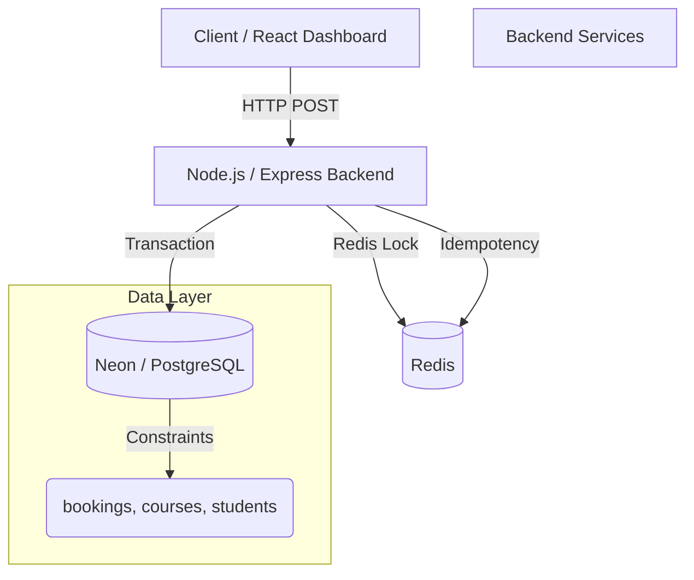
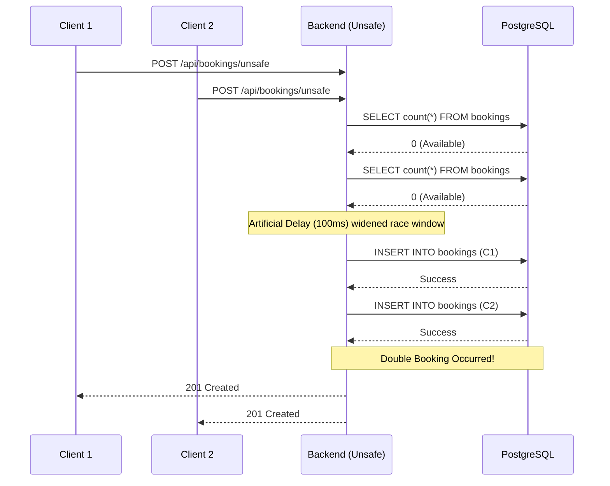
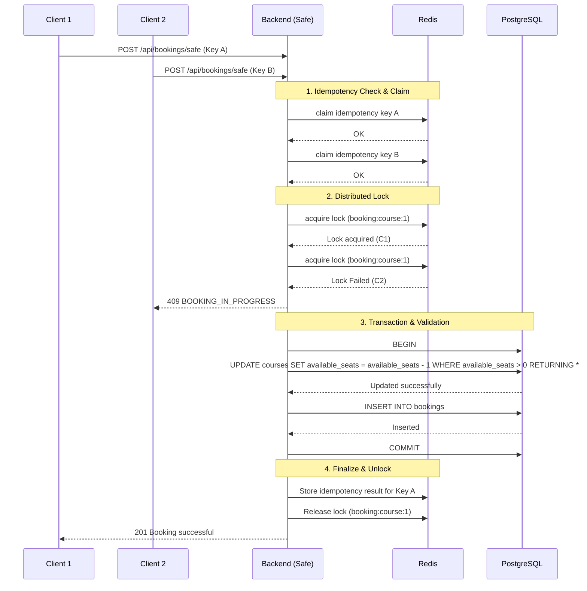

# System Architecture & Workflows

## High-Level System Architecture



## Unsafe Booking Workflow

This workflow represents the vulnerability of a typical "Check-Then-Insert" race condition.



## Safe Booking Workflow

The safe endpoint provides complete protection against double-booking through Idempotency, Redis Distributed Locking, and atomic PostgreSQL database updates.



## Redis Lock & PostgreSQL Transaction Relationship

The system relies on a two-tier locking mechanism to guarantee consistency and performance.

```mermaid
flowchart LR
    Request((Incoming Request))
    
    subgraph Tier 1: Application Level (Redis)
        RL[Redis Distributed Lock]
        RL_Desc[Prevents concurrent database connection saturation and immediate overlapping writes for the same course.]
    end
    
    subgraph Tier 2: Database Level (Postgres)
        PG[Atomic Update & Constraints]
        PG_Desc[Row-level locking during UPDATE and UNIQUE constraints provide the ultimate source of truth.]
    end
    
    Request -->|Requires| RL
    RL -->|Protects| PG
```

1. **Redis Distributed Lock (Tier 1):** Immediately rejects competing contenders (`409 BOOKING_IN_PROGRESS`) instead of queuing them. This protects the database from being flooded with overlapping transactions for a highly-contested resource.
2. **PostgreSQL Protection (Tier 2):** In the event the Redis lock fails, expires early, or is bypassed, the database uses atomic updates (`UPDATE ... WHERE available_seats > 0`) and unique constraints (`student_id, course_id`). This provides a mathematically sound limit on total bookings.

## Required Screenshots

*(The following screenshots should be captured and added to the `docs/images/` folder to complete the presentation).*

1. ``: The frontend dashboard loaded with a freshly reset course.
2. ``: Evidence of the unsafe experiment showing a double booking (e.g., booked > capacity).
3. ``: Evidence of the safe experiment successfully limiting bookings to exact capacity and returning conflicts.
4. ``: Terminal output showing all Jest automated tests passing (`npm test`). *(Note: This should be captured once the pre-existing database schema error involving the `email` column is resolved).*
5. ``: Terminal output showing the CLI load test results (e.g. `node src/concurrentRunner.js`).
